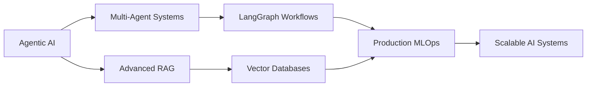

<div align="center">

# 👋 Hi, I'm Prabhu Teja Rompalli

### Data Scientist | AI Engineer | ML Specialist


[](https://linkedin.com/in/prabhu-teja-29a484338)
[](https://prabhuteja124.github.io/project_professional_portfoliomaster/)
[](mailto:prabhuteja124@gmail.com)
[](https://github.com/Prabhuteja124)

</div>

---

## 🚀 About Me

```python
class DataScientist:
    def __init__(self):
        self.name = "Prabhu Teja Rompalli"
        self.role = "Data Scientist & AI Engineer"
        self.location = "Hyderabad, India"
        self.expertise = ["Generative AI", "Time-Series Forecasting", "Computer Vision"]
        
    def get_impact(self):
        return {
            "trading_accuracy": "67% (vs 41% baseline)",
            "inventory_optimization": "15-20% reduction",
            "cv_accuracy": "90%+",
            "model_iterations": "25% faster"
        }
    
    def current_focus(self):
        return ["Agentic AI", "RAG Systems", "Multi-Agent Workflows", "MLOps"]
```

I build **production-ready AI solutions** that solve real business problems. My work spans **time-series forecasting**, **computer vision**, and **Generative AI systems**—from concept to deployment.

Currently specializing in developing **intelligent agents** and **RAG-based systems** that combine retrieval accuracy with reasoning capabilities.

---

## 💼 Professional Experience

<table>
<tr>
<td width="50%">

### 🔹 Nufintech (US Client)
**Data Science Intern** | *Dec 2025 - Jan 2026*

- 📊 Achieved **67% win rate** vs 41% baseline
- 🔧 Built causal pattern analysis framework
- ⚡ Automated reporting with **26% lift**

</td>
<td width="50%">

### 🔹 Rubixe AI Solutions
**Data Science AI Consultant** | *Oct 2024 - Jun 2025*

- 📈 Reduced stockouts by **15%**
- 📦 Decreased excess inventory by **20%**
- 🤖 Automated ML pipelines & dashboards

</td>
</tr>
</table>

---

## 🛠️ Tech Stack

### Languages & Core


### Machine Learning & AI


### Generative AI & LLMs


### Data Science & Visualization


### Deployment & MLOps


---

## 🎯 Featured Projects

<table>
<tr>
<td width="50%" valign="top">

### 🤖 Math Routing Agent
**Agentic RAG + MCP + Human-in-the-Loop**

Multi-agent system routing between VectorDB & web search

**Impact:**
- ✅ 95% math-only query accuracy
- 🔄 20% self-improvement via feedback
- ⚡ Real-time agent visibility

**Stack:**
`LangGraph` `Qdrant` `MCP` `DSPy` `FastAPI` `React` `Docker`

</td>
<td width="50%" valign="top">

### 🚗 License Plate Recognition
**Computer Vision + OCR + Deep Learning**

End-to-end pipeline for vehicle detection & text extraction

**Impact:**
- 🎯 90%+ accuracy on production data
- 📊 15% model performance boost
- ⚡ 25% faster inference

**Stack:**
`YOLOv8` `PaddleOCR` `OpenCV` `PyTorch` `TensorFlow`

</td>
</tr>
</table>

---

## 📊 GitHub Stats

<div align="center">
  


</div>

---

## 🏆 Certifications

<div align="center">


</div>

---

## 📈 What I'm Currently Learning



---

## 🎓 Education

**🎓 B.Tech in Electrical & Electronics Engineering**  
Jawaharlal Nehru Technological University, Kakinada (2021-2024)  
CGPA: 7.29/10

---

## 💡 Core Competencies

<div align="center">

| Domain | Technologies |
|--------|-------------|
| **Time-Series** | ARIMA, SARIMA, Prophet, LSTM, tsfresh, stumpy |
| **Deep Learning** | CNNs, RNNs, Transformers, Transfer Learning, Model Optimization |
| **Generative AI** | RAG, LangChain, LangGraph, Function Calling, Agentic Systems |
| **NLP** | Sentiment Analysis, Text Classification, NER, Summarization |
| **MLOps** | Docker, FastAPI, CI/CD, Model Monitoring, API Development |
| **Computer Vision** | YOLOv8, Object Detection, OCR, Image Processing |

</div>

---

## 📫 Let's Connect & Collaborate!

<div align="center">

I'm passionate about building **AI systems that think, reason, and assist**—not just predict.

Currently seeking opportunities in **Agentic AI**, **RAG Architectures**, and **Production ML**.

[](https://linkedin.com/in/prabhu-teja-29a484338)
[](mailto:prabhuteja124@gmail.com)
[](https://prabhuteja124.github.io/project_professional_portfoliomaster/)

---

### 💭 *"Building intelligent systems that combine reasoning, automation, and explainability—one model at a time."*

---


</div>

